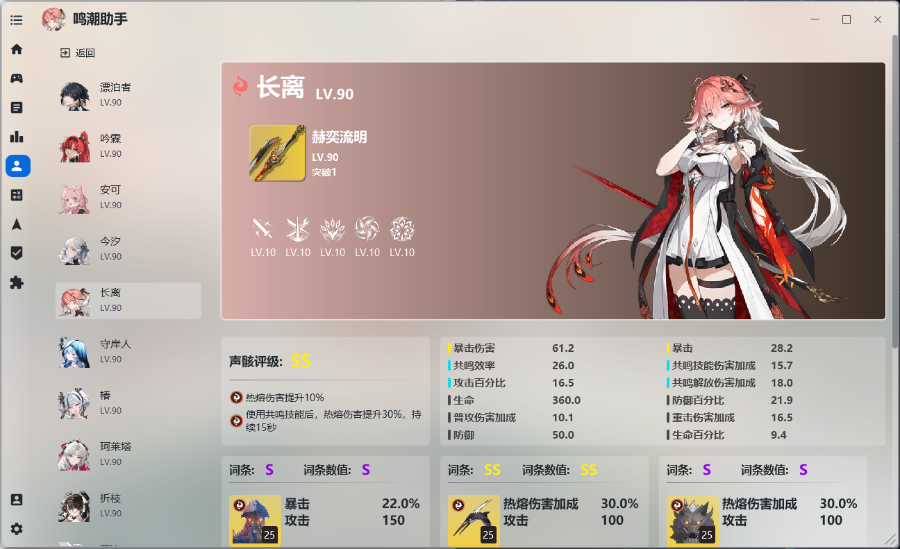

# 《--------------下面为本项目改写介绍---------》<br><br>
# 本项目由workbudyy+qclaw进行开发<br><br>
# 版本：1.6.2<br><br>
    1、根据源项目进行增加扫码登录<br><br>
    2、根据原有项目增加更新模块负责软件更新等操作<br><br>
    3、更改了原有的交流群方式，用户可点击加入群聊<br><br>
# 后续计划：<br><br>
    1、项目的移植：后续为了方便等，会更换C#语言进行编写本项目，同时会创建新的分支，但版本会处理为1.6.2.1进行区分<br><br>
    2、源1.5.2.1将会移除标签，后续会1.6.2为JavaFX项目开发，1.6.2.1为C#语言进行开发<br><br>
    3、因源作者项目1.6.2，加入了下载游戏，但对切换并未做出改变，后续将会进行相关功能的开发<br><br>
    4、完善国际服，国服，B服，wegame等互相切换服务器的功能<br><br>
    5、完善游戏本体验证，修复、下载功能<br><br>
    6、加入官方启动器壁纸界面，并可选背景功能<br><br>
    7、加入文档解答功能<br><br>
    8、加入开发日志功能<br><br>
    9、加入提交问题需求第三方，如飞书，腾讯文档等<br><br>
    10、增加对gitee、gitlab、gitcode等进行代码托管，为更新和服务器进行优化选择<br><br>
    11、改善代码在无登录环境下，可见全角色培养图鉴等<br><br>
    12、加入discode、kook等交流群<br><br>
    13、加入提交问题bug的日志入口<br><br>
    14、移除赞助功能与赞助账户登录功能


# 版本：1.5.2.1 作废<br><br>
# 修改<br><br>
1、修改源项目的兑换码逻辑，对过期的兑换嘛不在显示<br><br>
<br><br>

2、修改源项目的应用更新，将原有的更新功能移植本项目qwerwhr进行维护<br><br>
# 增加<br><br>
    1、由源项目的https://github.com/timetetng/wutheringwaves-cli-manager的下载逻辑，为后续
    开发切服器做准备，增加其窗口，现无实际功能，需要等到下一次的开发，进行功能的完善，后续
    可能需要第三方切服原理来实现，届时游戏的差异本体存放与GitHub进行托管，使用cdn或镜像资源
    来供服务器的转换；

<br><br>

    2、由源项目的https://github.com/DSVVA/KuRo_Scanner，其项目本意
    是屏幕扫码和直播间抢码登录，将其移植本项目，用来实现用户通过手机
    号验证码登录后，通过屏幕扫码实现登录游戏的目的，原理和请参考库街
    区扫码登录PC端鸣潮游戏，现已实现该功能，如后续问题，请提交需求到
    GitHub上，届时统一整理，并优化此功能；
<br><br>

#  后续计划：<br><br>
     1、完善国际服，国服，B服，wegame等互相切换服务器的功能
     2、完善游戏本体验证，修复、下载功能
     3、加入官方启动器壁纸界面，并可选背景功能
     4、加入文档解答功能
     5、加入开发日志功能
     6、加入提交问题需求第三方，如飞书，腾讯文档等
     7、提交gitee、gitlab、gitcode等进行代码托管，为更新和服务器进行优化选择
     8、改善代码在无登录环境下，可见全角色培养图鉴等
     9、更换原有的交流方式QQ群，加入discode、kook等交流群
     10、加入提交问题bug的日志入口

由于本项目为一人开发、借助AI进行开发的效率也会提升、后续将本项目代码功能移植到Flutter项目上，届时推出跨平台的应用，
如有开发者参与本项目的开发，也可以提交至本项目的分支上，为此感谢！<br>


<p align="center">
  
</p>

# 鸣潮助手 (WutheringWavesTool)

[](https://openjdk.org/)
[](https://openjfx.io/)
[](#感谢与支持)
[](https://github.com/qwerwhr/WutheringWavesTool/releases)

> 🌊 鸣潮助手是一款鸣潮的第三方 PC 端工具，可替代原生启动器，同时内置抽卡分析、游戏数据管理、资源更新等多个实用功能，致力于改善鸣潮的游戏体验与数据管理。支持国服与国际服。

## ⬇️ 下载

- 📦 **[点此下载程序](https://github.com/qwerwhr/WutheringWavesTool/releases)**
- 📖 **[点此查看使用教程](https://wave.999758.xyz/)**

## 📋 功能
---

> 助手支持国服与国际服。由于国际服不支持库街区，故国际服功能较少；

| 功能            | 说明                                                     | 国服 | 国际服 |
|:----------------|:---------------------------------------------------------|:----:|:------:|
| 🎮 启动器       | 替代原生启动器，集成 WIKI、浏览截图等小功能              |  ✅  |   ✅   |
| 🚀 高级启动     | 一键设置 DX11/DX12、自定义启动参数                       |  ✅  |   ✅   |
| 📂 资源管理     | 游戏资源更新、校验修复、预下载、服务器切换               |  ✅  |   ✅   |
| 🎲 抽卡分析     | 提供多种抽卡数据视图与统计分析                           |  ✅  |   ✅   |
| ⏱️ 游戏时长统计  | 统计每日游玩时长与总时长（推荐）                         |  ✅  |   ✅   |
| ⚔️ 战斗数据统计 | 统计每日战斗数据：战斗次数、声骸获取、闪避次数等（推荐） |  ✅  |   ✅   |
| 📊 基本游戏数据 | 每日体力、任务电台、各种宝箱数量                         |  ✅  |   ✅   |
| 🎁 兑换码       | 提供国服国际服兑换码及时提醒与查询                       |  ✅  |   ✅   |
| 🏛️ 扫码登录     | 使用扫码工具抢码可识别国服游戏的登录二维码               |  ✅  |   ❌   |
| 📅 库街区签到   | 最大支持 9 个账号同时签到，签到物品统计                  |  ✅  |   ❌   |
| 👤 角色查看     | 查看拥有的角色详情：共鸣链、等级、武器、声骸等           |  ✅  |   ❌   |
| 🧮 养成计算器   | 统计培养角色与武器所需的材料                             |  ✅  |   ❌   |
| 🏛️ 深塔历史数据 | 查看深塔历史数据                                         |  ✅  |   ❌   |

## 📸 部分截图

<p>
  
  
  
  
  
  
  
  
</p>

## 🛠️ 构建
---

### 环境要求

- ☕ JDK 25+
- 📦 Maven 3.9+

### 编译运行

```bash
# 克隆仓库
git clone https://github.com/qwerwhr/WutheringWavesTool.git
cd WutheringWavesTool

# 编译
mvn clean compile

# 运行
mvn javafx:run -pl wwt-app
```

## 💬 交流群

🐧 **1109211170**

---
## ❤️ 感谢与支持

### 感谢以下开源项目

- [OpenJFX](https://openjfx.io/)
- [ControlsFX](https://github.com/controlsfx/controlsfx)
- [MvvmFX](https://github.com/sialcasa/mvvmFX)
- [JNativeHook](https://github.com/kwhat/jnativehook)
- [Thumbnailator](https://github.com/coobird/thumbnailator)
- [Jackson](https://github.com/FasterXML/jackson)
- [JNA](https://github.com/java-native-access/jna)
- [AtlantaFX](https://github.com/mkpaz/atlantafx)
- [Ikonli](https://github.com/kordamp/ikonli)
- [SQLite JDBC](https://github.com/xerial/sqlite-jdbc)
- [Collapse](https://github.com/CollapseLauncher/Collapse)

🎨 项目背景作者为 [Rafa](https://www.pixiv.net/artworks/120767239)，感谢。

[//]: # (### 赞助)

[//]: # ()
[//]: # (倘若喜欢本程序，欢迎支持一下开发者，您的支持会加快软件的开发进度。)

[//]: # ()
[//]: # (您可以按以下格式留言：`[名称]:[想说的话]`)

[//]: # ()
[//]: # ()
