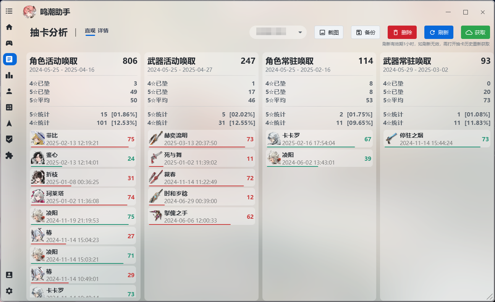

# 《--------------下面为本项目改写介绍---------》  
# 本项目由workbudyy+qclaw进行开发，请注意甄别AI编写的项目，另外由于项目打包方式还未摸索透彻，因此后续再进行打包和标签  
# 版本：1.5.2.1  
# 修改  
  1、修改源项目的兑换码逻辑，对过期的兑换嘛不在显示  
  

  2、修改源项目的应用更新，将原有的更新功能移植本项目qwerwhr进行维护  
# 增加  
    1、由源项目的https://github.com/timetetng/wutheringwaves-cli-manager的下载逻辑，为后续开发切服器做准备，
    增加其窗口，现无实际功能，需要等到下一次的开发，进行功能的完善，后续可能需要第三方切服原理来实现，届时游戏
    的差异本体存放与GitHub进行托管，使用cdn或镜像资源来供服务器的转换；
    
  

    2、由源项目的https://github.com/DSVVA/KuRo_Scanner，其项目本意是屏幕扫码和直播间抢码登录，将其移植本项目，
    用来实现用户通过手机号验证码登录后，通过屏幕扫码实现登录游戏的目的，原理和请参考库街区扫码登录PC端鸣潮游戏，
    现已实现该功能，如后续问题，请提交需求到GitHub上，届时统一整理，并优化此功能；
  

#  后续计划：  
     1、完善国际服，国服，B服，wegame等互相切换服务器的功能
     2、完善游戏本体验证，修复、下载功能
     3、加入官方启动器壁纸界面，并可选背景功能
     4、加入文档解答功能
     5、加入开发日志功能
     6、加入提交问题需求第三方，如飞书，腾讯文档等
     7、提交gitee、gitlab、gitcode等进行代码托管，为更新和服务器进行优化选择
     8、改善代码在无登录环境下，可见全角色培养图鉴等
     9、更换原有的交流方式QQ群，加入discode、kook等交流群
     10、加入提交问题bug的日志入口

由于本项目为一人开发、借助AI进行开发的效率也会提升、后续将本项目代码功能移植到Flutter项目上，届时推出跨平台的应用，
如有开发者参与本项目的开发，也可以提交至本项目的分支上，为此感谢！ 
     
### 《--------------下面为源项目介绍---------》  
## [中文](https://github.com/qwerwhr/WutheringWavesTool/blob/new-ui/README.md)
***
## 简介
鸣潮助手是一款鸣潮的第三方工具，可替代原生的启动器，同时内置多个有用的小功能，致力于改善PC端鸣潮的游戏体验与游戏数据管理。支持国服，国际服使用。

[点此下载程序](https://github.com/qwerwhr/WutheringWavesTool/releases)

[点此查看使用教程](https://wave.999758.xyz/)

## 功能
___
> 助手支持国服，国际服，由于国际服不支持库街区，故国际服功能少一些；
>
> WEGAME版需要手动转换为官服才能使用全部功能，具体请加Q群（984939498）查看公告获取教程。

1. 替代原生的启动器，集成WIKI，浏览截图等小功能。
2. 高级启动，一键设置DX11和DX12，解锁120帧率（鸣潮2.2后已失效）。
3. 抽卡分析，提供多种抽卡数据视图。
4. 游戏时长统计，只要使用本助手启动鸣潮，即可统计每日游玩时长与总时长。*（推荐)*
5. 游戏数据统计，只要使用本助手启动鸣潮，即可统计每日战斗数据，包括不限于战斗次数，大世界获取的声骸数量，闪避成功次数。*（推荐)*
6. 显示基本游戏数据，包括不限于每日体力，任务电台，各种宝箱数量。*（仅支持国服）*
7. 库街区签到，最大支持9个账号同时签到；签到统计，可以查看签到一共获取了多少物品。*（仅支持国服）*
8. 查看角色，可以查看拥有的角色以及详情，包括共鸣连，等级，武器，声骸等等。*（仅支持国服）*
9. 养成计算器，统计培养每个角色与武器所需的材料*（仅支持国服）*
10. 查看深塔历史数据。*（仅支持国服）*

## 部分截图

## 感谢与支持
***
### 感谢以下开源项目
* [OpenJFX](https://openjfx.io/)
* [Controlsfx](https://github.com/controlsfx/controlsfx)
* [MvvmFX](https://github.com/sialcasa/mvvmFX)
* [Jnativehook](https://github.com/kwhat/jnativehook)
* [Thumbnailator](https://github.com/coobird/thumbnailator)
* [Jackson](https://github.com/FasterXML/jackson)
* [JNA](https://github.com/java-native-access/jna)
* [Atlantafx](https://github.com/mkpaz/atlantafx)
* [Ikonli](https://github.com/kordamp/ikonli)
* [Sqlite-jdbc](https://github.com/xerial/sqlite-jdbc)
* [Collapse](https://github.com/CollapseLauncher/Collapse)

项目背景作者为[Rafa](https://www.pixiv.net/artworks/120767239)，感谢。
